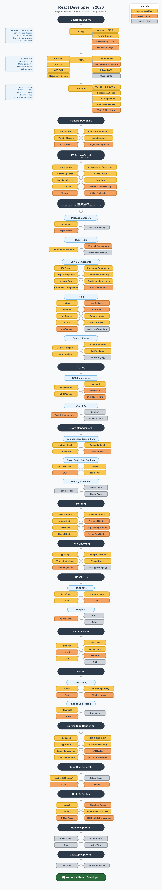

<div align="center">

# ⚛️ React Developer Roadmap 2026

### Beginner Edition — Roadmap to becoming a React developer

[](https://github.com)
[](https://github.com)
[](https://creativecommons.org/licenses/by-nc-sa/4.0/)

*Inspired by [adam-golab/react-developer-roadmap](https://github.com/adam-golab/react-developer-roadmap)*

</div>

---

> **This roadmap is for absolute beginners.** Follow it **top to bottom** — each step builds on the previous one. Do not skip ahead and do not try to learn everything at once. Depth beats breadth.

## Purpose

The goal is to give you a clear, opinionated path — not an overwhelming list of options. This is specifically tuned for 2026: outdated tools removed, modern replacements added, and beginner-friendly notes throughout.

> "The map will guide you if you are confused about what to learn next — not encourage you to pick what is trendy."

---

## 🗺️ Roadmap



### Legend

| Color | Meaning |
|-------|---------|
| 🟡 **Yellow** | Personal Must Know — learn this, no exceptions |
| 🟠 **Orange** | Good to Know — learn after the yellow items |
| ⬜ **Gray** | Possibilities — optional, explore when ready |

---

## 📚 Resources & Explanations

### 1. Learn the Basics

> **Do not touch React until you are solid here.** React is just JavaScript — if your JS is shaky, React will feel like magic you cannot control.

#### 🟡 HTML
- **Learn the basics** — headings, paragraphs, links, images, divs, spans
- **Semantic HTML5** — use `<header>`, `<main>`, `<section>`, `<article>`, `<footer>` instead of just `<div>` everywhere
- **Forms and Inputs** — `<form>`, `<input>`, `<textarea>`, `<select>`, `<button>` — forms are everywhere in React apps
- **Accessibility basics** — `alt` attributes on images, `aria-label` on buttons, keyboard navigation
- **Meta and SEO Tags** — `<title>`, `<meta description>`, Open Graph tags

> 📖 Resource: [MDN HTML Guide](https://developer.mozilla.org/en-US/docs/Learn/HTML)

#### 🟡 CSS
- **Box Model** — margin, border, padding, content — understand this before anything else
- **Flexbox** — the most important layout tool for React UIs. Learn `display: flex`, `justify-content`, `align-items`, `gap`
- **CSS Grid** — for 2D layouts. Learn alongside Flexbox
- **Responsive Design** — media queries, mobile-first design, `rem` vs `px`
- **CSS Variables** — `--primary-color: #333;` — used in every modern codebase
- **Transitions and Animations** — smooth UI interactions with `transition` and `@keyframes`
- 🟠 **Sass / SCSS** — variables, nesting, mixins — learn after core CSS

> 📖 Resource: [Kevin Powell CSS YouTube Channel](https://www.youtube.com/@KevinPowell) | [CSS Tricks Guide to Flexbox](https://css-tricks.com/snippets/css/a-guide-to-flexbox/)

#### 🟡 JS Basics
- **Variables and Data Types** — `let`, `const` (not `var`), strings, numbers, booleans, arrays, objects
- **Functions and Scope** — function declarations, arrow functions, scope, closures
- **DOM Manipulation** — `document.querySelector`, `addEventListener`, `innerHTML`, `classList`
- **Events and Listeners** — `click`, `submit`, `change`, `keydown` events
- 🟠 **JSON and APIs (intro)** — `JSON.parse()`, `JSON.stringify()`, what an API response looks like

> 📖 Resource: [javascript.info](https://javascript.info) — the best free JS resource available

---

### 2. General Development Skills

> These are not React-specific — they are skills every developer needs. Invest time here early.

| Skill | Why It Matters | Resource |
|-------|---------------|----------|
| 🟡 **Git and GitHub** | Track code, collaborate, undo mistakes | [GitHub Skills](https://skills.github.com) |
| 🟡 **Terminal Basics** | Navigate folders, run scripts, install packages | [The Odin Project Terminal](https://www.theodinproject.com/lessons/foundations-command-line-basics) |
| 🟡 **VS Code + Extensions** | Install ESLint, Prettier, ES7 React Snippets, GitLens | [VS Code Docs](https://code.visualstudio.com/docs) |
| 🟡 **Node.js and npm** | Required to run React tooling. Install LTS from nodejs.org | [Node.js](https://nodejs.org) |
| 🟠 **HTTP Basics** | GET, POST, status codes (200, 404, 500), headers, REST | [MDN HTTP Overview](https://developer.mozilla.org/en-US/docs/Web/HTTP/Overview) |
| 🟠 **Google and Debugging** | Read error messages, use DevTools, search effectively | [Chrome DevTools](https://developer.chrome.com/docs/devtools/) |

**Essential Git commands for beginners:**
```bash
git init                    # start a repo
git add .                   # stage all changes
git commit -m "message"     # save a snapshot
git push origin main        # upload to GitHub
git pull                    # download latest changes
git checkout -b feature     # create a new branch
```

---

### 3. ES6+ JavaScript

> This is the most important phase before React. React uses ALL of these modern JS features constantly.

#### 🟡 Must-Know Features

**Destructuring** — extract values from objects and arrays:
```js
const { name, age } = user;           // object destructuring
const [first, second] = items;        // array destructuring
const { name = 'Anonymous' } = user;  // with default value
```

**Spread Operator** — copy and merge:
```js
const newUser = { ...user, age: 30 }; // copy + override
const newArr = [...items, newItem];    // add to array (React state pattern)
```

**Template Literals**:
```js
const greeting = `Hello, ${name}! You are ${age} years old.`;
```

**ES Modules**:
```js
// Exporting
export const Button = () => <button>Click</button>;
export default function App() { ... }

// Importing
import App from './App';
import { Button, Card } from './components';
```

**Array Methods** — used in every React list:
```js
const doubled = numbers.map(n => n * 2);             // transform each item
const evens = numbers.filter(n => n % 2 === 0);      // keep matching items
const found = users.find(u => u.id === 1);            // find first match
const total = prices.reduce((sum, p) => sum + p, 0); // accumulate
```

**Async / Await** — for fetching data:
```js
async function fetchUsers() {
  try {
    const response = await fetch('https://api.example.com/users');
    const data = await response.json();
    return data;
  } catch (error) {
    console.error('Fetch failed:', error);
  }
}
```

#### 🟠 Good to Know
- **Optional Chaining** — `user?.address?.city` (will not crash if address is undefined)
- **Nullish Coalescing** — `value ?? 'default'` (only uses default if value is null/undefined)
- **Closures** — functions that remember their surrounding scope
- **Higher-Order Functions** — functions that take or return other functions

> 📖 Resource: [javascript.info Modern JavaScript](https://javascript.info) | [Wes Bos ES6 Course (free)](https://es6.io)

---

### 4. React Core

> Start with Vite — it is the fastest, simplest way to create React apps in 2026:
> ```bash
> npm create vite@latest my-app -- --template react
> cd my-app
> npm install
> npm run dev
> ```

#### Package Managers

| Tool | Description | Command |
|------|-------------|---------|
| 🟡 **npm** | Comes with Node.js. Use this to start | `npm install react` |
| 🟠 **pnpm** | Faster, more disk-efficient alternative | `pnpm install react` |
| ⬜ **yarn** | Another alternative, older projects use it | `yarn add react` |

#### Build Tools

| Tool | Description | Use When |
|------|-------------|----------|
| 🟡 **Vite** | Lightning fast, zero config, the 2026 standard | Starting any new React project |
| 🟠 **Webpack** | Older but ubiquitous — you will encounter it in jobs | Working on existing codebases |
| ⬜ **Turbopack** | Webpack successor, powers Next.js 15 | Using Next.js |

#### JSX and Components

**JSX** is HTML-like syntax inside JavaScript. Key differences from HTML:
```jsx
// HTML  →  JSX differences
class="btn"        →  className="btn"
for="input"        →  htmlFor="input"
              →               (self-closing required)
onclick="fn()"     →  onClick={fn}        (camelCase, no quotes)
style="color:red"  →  style={{ color: 'red' }}   (object syntax)
```

**Functional Components** (the only kind you need in 2026):
```jsx
// Basic component with destructured props
function Greeting({ name, age }) {
  return (
    <div className="greeting">
      <h1>Hello, {name}!</h1>
      <p>Age: {age}</p>
    </div>
  );
}

// Arrow function style with default prop value
const Button = ({ onClick, children, disabled = false }) => (
  <button onClick={onClick} disabled={disabled}>
    {children}
  </button>
);
```

**Conditional Rendering:**
```jsx
// && operator — render if true
{isLoggedIn && <UserPanel />}

// Ternary — if/else
{isLoading ? <Spinner /> : <Content />}

// Early return pattern
if (error) return <ErrorMessage />;
```

**Rendering Lists — always use a key:**
```jsx
const UserList = ({ users }) => (
  <ul>
    {users.map(user => (
      <li key={user.id}>       {/* key must be unique and stable */}
        {user.name}
      </li>
    ))}
  </ul>
);
```

#### React Hooks

**useState** — local component state:
```jsx
const [count, setCount] = useState(0);
const [user, setUser] = useState(null);
const [items, setItems] = useState([]);

// NEVER mutate state directly
items.push(newItem);           // WRONG — React won't re-render
setItems([...items, newItem]); // CORRECT — spread creates a new array
```

**useEffect** — side effects (data fetching, subscriptions, timers):
```jsx
useEffect(() => { console.log('rendered'); });            // after every render

useEffect(() => { fetchData(); }, []);                    // once on mount

useEffect(() => { fetchUser(userId); }, [userId]);        // when userId changes

useEffect(() => {                                         // with cleanup
  const timer = setInterval(tick, 1000);
  return () => clearInterval(timer);
}, []);
```

**useContext** — share state without prop drilling:
```jsx
const ThemeContext = createContext('light');

// Wrap app with provider
<ThemeContext.Provider value="dark">
  <App />
</ThemeContext.Provider>

// Consume anywhere in the tree
const theme = useContext(ThemeContext);
```

**useRef** — access DOM elements directly:
```jsx
const inputRef = useRef(null);

<input ref={inputRef} />
<button onClick={() => inputRef.current.focus()}>Focus input</button>
```

**Custom Hooks** — extract reusable stateful logic:
```jsx
function useLocalStorage(key, initialValue) {
  const [value, setValue] = useState(
    () => JSON.parse(localStorage.getItem(key)) ?? initialValue
  );
  const setItem = (newValue) => {
    setValue(newValue);
    localStorage.setItem(key, JSON.stringify(newValue));
  };
  return [value, setItem];
}

// Usage in any component
const [theme, setTheme] = useLocalStorage('theme', 'light');
```

#### Forms and Events

**Controlled inputs** (the recommended React pattern):
```jsx
function LoginForm() {
  const [email, setEmail] = useState('');
  const [password, setPassword] = useState('');

  const handleSubmit = (e) => {
    e.preventDefault(); // prevent page refresh
    console.log({ email, password });
  };

  return (
    <form onSubmit={handleSubmit}>
      <input
        type="email"
        value={email}
        onChange={(e) => setEmail(e.target.value)}
      />
      <input
        type="password"
        value={password}
        onChange={(e) => setPassword(e.target.value)}
      />
      <button type="submit">Login</button>
    </form>
  );
}
```

🟡 **React Hook Form** — for complex forms with less boilerplate:
```bash
npm install react-hook-form zod @hookform/resolvers
```

🟡 **Zod** — schema-based validation:
```js
import { z } from 'zod';
const schema = z.object({
  email: z.string().email('Invalid email'),
  age: z.number().min(18, 'Must be 18 or older'),
});
```

> 📖 Resource: [react.dev](https://react.dev) — the official React docs are exceptional. Start here.

---

### 5. Styling

#### CSS Frameworks

| Tool | Type | Best For | Verdict |
|------|------|----------|---------|
| 🟡 **Tailwind CSS** | Utility-first | Fast prototyping, modern apps | Learn this first in 2026 |
| 🟡 **CSS Modules** | Scoped CSS | Component styles, zero config | Built into Vite — use it |
| 🟡 **shadcn/ui** | Component library | Pre-built accessible components | Add after learning Tailwind |
| 🟠 **MUI (Material UI)** | Component library | Enterprise/corporate apps | Learn if job requires it |
| 🟠 **Bootstrap** | CSS Framework | Quick prototypes, older codebases | Know the basics |

**Tailwind CSS example — no CSS file needed:**
```jsx
<button className="bg-blue-500 hover:bg-blue-700 text-white font-bold py-2 px-4 rounded transition-colors duration-200">
  Click me
</button>
```

#### CSS-in-JS (learn after the above)

| Tool | Use When |
|------|----------|
| 🟠 **Styled Components** | Need dynamic styles with full theming |
| ⬜ **Emotion** | Similar to Styled Components, used in MUI |
| ⬜ **Vanilla Extract** | Zero-runtime CSS-in-JS, TypeScript-first |

---

### 6. State Management

> **Start simple. Add complexity only when you genuinely feel the pain of not having it.**

```
useState  →  Context API  →  Zustand  →  (Redux only if the job requires it)
```

#### Component and Context State

🟡 **useState + props** — covers 80% of apps. Use this first.

🟡 **Context API** — for truly global state (auth, theme, language):
```jsx
// AuthContext.jsx
const AuthContext = createContext(null);

export function AuthProvider({ children }) {
  const [user, setUser] = useState(null);
  const login = (userData) => setUser(userData);
  const logout = () => setUser(null);

  return (
    <AuthContext.Provider value={{ user, login, logout }}>
      {children}
    </AuthContext.Provider>
  );
}

// In any component — no prop drilling needed
const { user, login, logout } = useContext(AuthContext);
```

🟡 **Zustand** — lightweight global state, much simpler than Redux:
```js
import { create } from 'zustand';

const useCartStore = create((set) => ({
  items: [],
  addItem: (item) => set((state) => ({ items: [...state.items, item] })),
  removeItem: (id) => set((state) => ({ items: state.items.filter(i => i.id !== id) })),
}));

// In any component
const { items, addItem } = useCartStore();
```

#### Server State (Data Fetching)

🟡 **TanStack Query** — the modern standard for server-side data:
```jsx
import { useQuery, useMutation, useQueryClient } from '@tanstack/react-query';

// Fetching with automatic loading, error, and caching
const { data, isLoading, error } = useQuery({
  queryKey: ['users'],
  queryFn: () => fetch('/api/users').then(r => r.json()),
});

// Mutating and invalidating cache
const queryClient = useQueryClient();
const mutation = useMutation({
  mutationFn: (newUser) => fetch('/api/users', {
    method: 'POST',
    body: JSON.stringify(newUser),
  }),
  onSuccess: () => queryClient.invalidateQueries({ queryKey: ['users'] }),
});
```

#### Redux (Learn Later)

| Tool | When to Learn |
|------|--------------|
| ⬜ **Redux Toolkit** | Large teams, complex state, or explicit job requirement |
| ⬜ **Redux Thunk** | Async actions in Redux (built into Redux Toolkit) |
| ⬜ **Redux Saga** | Very complex async flows — most apps do not need this |

> **Do not learn Redux as a beginner.** Zustand + TanStack Query covers 95% of real use cases with a fraction of the complexity.

---

### 7. Routing

🟡 **React Router v7** — the standard for React client-side routing:
```bash
npm install react-router-dom
```

```jsx
// App.jsx — set up your routes
import { BrowserRouter, Routes, Route } from 'react-router-dom';

function App() {
  return (
    <BrowserRouter>
      <Routes>
        <Route path="/" element={<Home />} />
        <Route path="/about" element={<About />} />
        <Route path="/users/:id" element={<UserDetail />} />
        <Route path="*" element={<NotFound />} />
      </Routes>
    </BrowserRouter>
  );
}

// Useful hooks
const { id } = useParams();           // get :id from URL
const navigate = useNavigate();       // programmatic navigation
navigate('/dashboard');               // redirect to a route

// Protected route pattern
function PrivateRoute({ children }) {
  const { user } = useContext(AuthContext);
  return user ? children : <Navigate to="/login" />;
}
```

| Feature | Tool |
|---------|------|
| 🟡 Client-side routing | React Router v7 |
| 🟡 URL parameters | `useParams()` |
| 🟡 Programmatic navigation | `useNavigate()` |
| 🟡 Nested routes and layouts | `<Outlet />` |
| 🟠 Protected routes | Custom wrapper component |
| 🟠 Lazy loading routes | `React.lazy()` + `Suspense` |
| 🟠 File-based routing | Next.js App Router |

---

### 8. Type Checking

> TypeScript is the industry standard in 2026. Start learning it on your second or third React project.

🟡 **TypeScript** — catch bugs before runtime:
```tsx
// Typing props with an interface
interface ButtonProps {
  label: string;
  onClick: () => void;
  disabled?: boolean;                           // optional prop
  variant?: 'primary' | 'secondary' | 'danger'; // union type
}

const Button = ({ label, onClick, disabled = false, variant = 'primary' }: ButtonProps) => (
  <button onClick={onClick} disabled={disabled} className={`btn-${variant}`}>
    {label}
  </button>
);

// Typing useState
const [user, setUser] = useState<User | null>(null);
const [items, setItems] = useState<string[]>([]);

// Typing async functions
async function fetchUser(id: number): Promise<User> {
  const res = await fetch(`/api/users/${id}`);
  return res.json();
}
```

| Tool | Verdict |
|------|---------|
| 🟡 **TypeScript** | Learn it on your 2nd or 3rd project — it is the standard |
| 🟡 **Typing React Props** | Use `interface Props {}` for all components |
| 🟠 **Generics** | `useState<User>()`, `Array<string>` — learn progressively |
| ⬜ **PropTypes** | Legacy runtime type checking — TypeScript replaces this |

---

### 9. API Clients

#### REST APIs

| Tool | Use When |
|------|---------|
| 🟡 **fetch() API** | Simple requests — built into browsers, no install needed |
| 🟡 **Axios** | Better error handling, request/response interceptors |
| 🟡 **TanStack Query** | Production apps — caching, background sync, loading states |
| 🟠 **SWR** | Lighter alternative to TanStack Query |

**fetch() pattern with proper error handling:**
```js
const res = await fetch('https://api.example.com/users', {
  method: 'POST',
  headers: { 'Content-Type': 'application/json' },
  body: JSON.stringify({ name: 'Alice' }),
});
if (!res.ok) throw new Error(`HTTP error: ${res.status}`);
const data = await res.json();
```

#### GraphQL

| Tool | Use When |
|------|---------|
| 🟠 **Apollo Client** | Full-featured GraphQL client — most popular |
| ⬜ **urql** | Lightweight GraphQL client |
| ⬜ **Relay** | Meta's GraphQL client — complex, for large apps |

---

### 10. Utility Libraries

| Library | Category | What It Does |
|---------|----------|-------------|
| 🟡 **Zod** | Validation | Schema validation for forms and API responses |
| 🟡 **clsx / cn()** | Styling | Conditionally join CSS class names cleanly |
| 🟡 **date-fns** | Dates | Format and manipulate dates — lightweight alternative to moment.js |
| 🟡 **Lucide React** | Icons | Clean, consistent SVG icon library |
| 🟠 **Lodash** | Utilities | Array, object, string utility functions |
| 🟠 **Recharts** | Charts | Composable React chart components |
| ⬜ **RxJS** | Reactive | Observable streams — advanced use cases only |

```js
// clsx — conditional class names
import { clsx } from 'clsx';
const classes = clsx('btn', { 'btn-active': isActive, 'btn-disabled': disabled });

// date-fns — date formatting
import { format, formatDistanceToNow } from 'date-fns';
format(new Date(), 'MMM dd, yyyy');         // "Feb 18, 2026"
formatDistanceToNow(new Date(2025, 0, 1));  // "about 13 months ago"
```

---

### 11. Testing

> Start with unit tests once you are comfortable with React. Test your most critical components first.

#### Unit Testing

| Tool | Role |
|------|------|
| 🟡 **Vitest** | Test runner built for Vite — fast, Jest-compatible API |
| 🟡 **React Testing Library** | Test components the way users interact with them |
| 🟠 **Jest** | Older test runner — still widely used in existing projects |

```jsx
// Button.test.jsx
import { render, screen, fireEvent } from '@testing-library/react';
import { describe, it, expect, vi } from 'vitest';
import Button from './Button';

describe('Button', () => {
  it('renders the label', () => {
    render(<Button label="Click me" onClick={() => {}} />);
    expect(screen.getByText('Click me')).toBeInTheDocument();
  });

  it('calls onClick when clicked', () => {
    const handleClick = vi.fn();
    render(<Button label="Click" onClick={handleClick} />);
    fireEvent.click(screen.getByText('Click'));
    expect(handleClick).toHaveBeenCalledOnce();
  });
});
```

#### End-to-End Testing

| Tool | Verdict |
|------|---------|
| 🟡 **Playwright** | Modern, cross-browser, fastest E2E tool in 2026 |
| 🟠 **Cypress** | Visual, beginner-friendly, great developer experience |
| ⬜ **Puppeteer** | Low-level browser automation library |

---

### 12. Server-Side Rendering — Next.js 15

> Next.js is where most React jobs are in 2026. Learn it after you are solid with React basics.

🟡 **Next.js App Router** — file-based routing with layouts:
```
app/
├── layout.tsx           # root layout wrapping all pages
├── page.tsx             # home page    →  /
├── about/
│   └── page.tsx         # about page   →  /about
├── blog/
│   ├── page.tsx         # blog index   →  /blog
│   └── [slug]/
│       └── page.tsx     # blog post    →  /blog/my-post
└── api/
    └── users/
        └── route.ts     # API endpoint →  GET /api/users
```

🟡 **Server vs Client Components:**
```tsx
// SERVER Component (default) — runs on server, zero JS shipped to client
// app/page.tsx
async function HomePage() {
  const data = await fetch('https://api.example.com/posts').then(r => r.json());
  return <PostList posts={data} />;  // no useEffect or loading state needed
}

// CLIENT Component — add 'use client' for any interactivity
'use client';
import { useState } from 'react';

function Counter() {
  const [count, setCount] = useState(0);
  return <button onClick={() => setCount(c => c + 1)}>{count}</button>;
}
```

| Feature | Description |
|---------|-------------|
| 🟡 **App Router** | New standard — `app/` directory with layouts and pages |
| 🟡 **Server Components** | Default — render on server, zero JS bundle impact |
| 🟡 **Client Components** | `'use client'` — for useState, useEffect, event handlers |
| 🟡 **SSR** | Server-Side Rendering — fresh data on every request |
| 🟡 **SSG** | Static Generation — pre-built at deploy time |
| 🟠 **ISR** | Incremental Static Regeneration — revalidate stale pages |
| 🟠 **API Routes** | `app/api/route.ts` — backend endpoints in the same project |
| 🟠 **next/image** | Optimized, lazy-loaded, correctly sized images |
| 🟠 **next/font** | Self-hosted fonts with zero layout shift |

---

### 13. Static Site Generator

| Tool | Use When |
|------|---------|
| 🟡 **Next.js (SSG mode)** | Blog, docs, marketing site — you already know Next.js |
| 🟠 **Astro** | Content-heavy sites — ships zero JavaScript by default |
| 🟠 **Remix** | Full-stack React alternative to Next.js |
| ⬜ **Gatsby** | Legacy — Next.js covers all its use cases now |

---

### 14. Build and Deploy

> Deploy your first project as soon as possible — it is motivating and teaches real-world skills.

🟡 **Build for production:**
```bash
npm run build        # creates optimized dist/ folder
npm run preview      # test the production build locally
```

**Environment variables — keep secrets out of code:**
```bash
# .env.local (never commit this to GitHub)
VITE_API_URL=https://api.yourapp.com
VITE_APP_NAME=MyReactApp
```
```js
// In code — Vite requires the VITE_ prefix
const apiUrl = import.meta.env.VITE_API_URL;
```

#### Deployment Platforms

| Platform | Free Tier | Best For | How to Deploy |
|----------|-----------|----------|----------------|
| 🟡 **Vercel** | Generous | React, Next.js | Connect GitHub — auto-deploys on every push |
| 🟡 **Netlify** | Generous | Vite SPAs | `netlify deploy` or drag-and-drop `dist/` |
| 🟠 **GitHub Pages** | Free | Static sites from repos | GitHub Actions workflow |
| 🟠 **Cloudflare Pages** | Very generous | Fast global CDN | Connect GitHub |

🟠 **CI/CD with GitHub Actions:**
```yaml
# .github/workflows/deploy.yml
name: Deploy
on:
  push:
    branches: [main]
jobs:
  deploy:
    runs-on: ubuntu-latest
    steps:
      - uses: actions/checkout@v4
      - uses: actions/setup-node@v4
        with: { node-version: 20 }
      - run: npm ci
      - run: npm run test
      - run: npm run build
```

---

### 15. Mobile (Optional)

> Use your React knowledge to build iOS and Android apps.

| Tool | Description |
|------|-------------|
| ⬜ **React Native** | Write React components, ship native iOS and Android apps |
| ⬜ **Expo** | Easiest way to get started with React Native |
| ⬜ **Expo Router** | File-based routing for React Native — like Next.js for mobile |
| ⬜ **NativeWind** | Tailwind CSS utilities for React Native |

---

### 16. Desktop (Optional)

| Tool | Description |
|------|-------------|
| ⬜ **Electron** | Web-based desktop apps — VS Code, Slack, Figma are built on it |
| ⬜ **Tauri** | Rust-based alternative — smaller bundles, faster startup |

---

## 🗓️ Suggested Learning Timeline

| Week | Phase | Goal |
|------|-------|------|
| **1–2** | HTML + CSS | Build 3 static HTML/CSS pages |
| **3–5** | JavaScript Basics | Build a DOM-manipulation project |
| **6–7** | ES6+ JavaScript | Comfortable with async/await, array methods |
| **8** | Dev Tools | Git workflow, terminal, VS Code setup |
| **9–11** | React Core | Todo app, counter, simple component library |
| **12–13** | Hooks + Data Fetching | Weather app or movie search with API |
| **14** | React Router | Multi-page SPA |
| **15** | Tailwind + Styling | Polish your existing projects |
| **16** | State Management | Add Zustand to a project |
| **17–18** | TypeScript | Convert an existing project to TypeScript |
| **19–20** | Next.js | Blog or portfolio site with App Router |
| **21–22** | Testing | Add Vitest + React Testing Library to a project |
| **23+** | Deploy + Portfolio | Ship real projects, build your portfolio |

---

## 🏗️ Project Ideas (Build These!)

Build projects to solidify each phase — do not just watch tutorials:

| Project | Skills Practiced | Difficulty |
|---------|-----------------|------------|
| Counter App | useState, events | ⭐ |
| Todo List | CRUD, local state, lists and keys | ⭐⭐ |
| Calculator | State, conditional logic, component design | ⭐⭐ |
| Weather App | useEffect, fetch, API, loading and error states | ⭐⭐ |
| GitHub Profile Viewer | React Router, dynamic routes, GitHub API | ⭐⭐⭐ |
| Movie Search App | TanStack Query, URL search params, pagination | ⭐⭐⭐ |
| Personal Portfolio | Next.js, Tailwind, deployed live | ⭐⭐⭐ |
| Auth Flow | Context API, protected routes, forms with Zod | ⭐⭐⭐ |
| E-commerce Cart | Zustand, complex state, TypeScript | ⭐⭐⭐⭐ |
| Full-Stack Blog | Next.js App Router + Supabase, SSR | ⭐⭐⭐⭐ |

---

## 🔧 The 2026 React Stack

```
Framework:    Next.js 15 (App Router)
Language:     TypeScript
Styling:      Tailwind CSS + shadcn/ui
State:        Zustand + TanStack Query
Forms:        React Hook Form + Zod
Testing:      Vitest + React Testing Library + Playwright
Icons:        Lucide React
Dates:        date-fns
Deployment:   Vercel
Database:     Supabase
ORM:          Prisma or Drizzle
```

---

## Common Beginner Mistakes

| Mistake | Why It Hurts | Fix |
|---------|-------------|-----|
| Skipping JavaScript | React IS JavaScript — shaky JS means shaky React | Do [javascript.info](https://javascript.info) first |
| Mutating state directly | `items.push()` will not re-render the component | Always use the setter: `setItems([...items, newItem])` |
| Overusing useEffect | Creates complex, buggy, hard-to-debug code | Learn [You Might Not Need an Effect](https://react.dev/learn/you-might-not-need-an-effect) |
| Learning Redux too early | Adds complexity beginners do not need | Learn Zustand first |
| Tutorial hell | Watching does not equal knowing | Build projects immediately after learning |
| Ignoring TypeScript | It is the industry standard | Start on your 2nd project |
| Not reading error messages | Error messages tell you exactly what went wrong | Read every error carefully |
| Prop drilling everything | Passing state 5 levels deep is painful | Learn Context API or Zustand |

---

## 📖 Recommended Free Resources

| Resource | Type | Best For |
|----------|------|----------|
| [react.dev](https://react.dev) | Docs | Official React docs — excellent interactive examples |
| [javascript.info](https://javascript.info) | Tutorial | The best modern JavaScript resource online |
| [Next.js Docs](https://nextjs.org/docs) | Docs | Official Next.js documentation with great tutorials |
| [The Odin Project](https://theodinproject.com) | Curriculum | Full HTML, CSS, JS curriculum |
| [Josh W. Comeau's Blog](https://joshwcomeau.com) | Blog | Deep CSS and React articles |
| [TkDodo's Blog](https://tkdodo.eu/blog) | Blog | Best TanStack Query resource available |
| [Fireship on YouTube](https://youtube.com/@Fireship) | Video | Short, high-quality developer videos |
| [Kevin Powell on YouTube](https://youtube.com/@KevinPowell) | Video | CSS mastery |
| [Total TypeScript](https://totaltypescript.com) | Course | TypeScript fundamentals — free exercises |

---

## Beginner Checklist

Before calling yourself a React developer:

- [ ] I can explain the difference between state and props
- [ ] I can build a component that fetches and displays API data
- [ ] I understand why keys matter in lists
- [ ] I have implemented client-side routing with React Router
- [ ] I have used React Hook Form for form handling
- [ ] I have deployed a React app live on the internet
- [ ] I can create and use a custom hook
- [ ] I have started writing TypeScript in React
- [ ] I have written basic unit tests with Vitest
- [ ] I have built and deployed a Next.js project

---

## 🤝 Contributing

This roadmap is meant to evolve with the ecosystem. If you find outdated information or think something should be added:

1. Open an issue to discuss the change
2. Fork the repo and make your edits
3. Submit a pull request

---

## 📄 License

[](https://creativecommons.org/licenses/by-nc-sa/4.0/)

Licensed under [Creative Commons Attribution-NonCommercial-ShareAlike 4.0 International](https://creativecommons.org/licenses/by-nc-sa/4.0/).

---

<div align="center">

**Built with care for beginner React developers in 2026**

If this roadmap helped you, star the repo — it helps others find it

</div>
